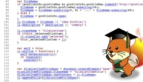

## FxOS コードリーディング
# ミートアップ 

---
## 会場説明

   * WiFi: テーブルの上の紙をご参照下さい。
   * ハッシュタグ: &num;fxos
   * トイレ: 左手奥にあります。

---
## Agenda

   * オープニング
   * ゆるふわ自己紹介 (ALL)
   * わいわいコードリーディング
   * この場で懇親会的なもの (21:00頃~)
   * クロージング (22:00)

---
## 自己紹介

   * お名前。
   * 普段やっていること。
   	- 仕事、コミュニティ活動、趣味とか。
   * FxOS で読んだことある所。(あれば)
   * 今日読みたい所、やりたいこと。
